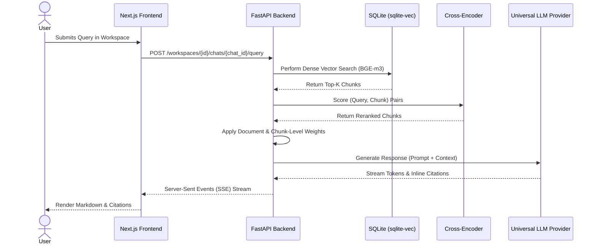

# Lete

Lete is an advanced Retrieval-Augmented Generation (RAG) system designed for deep, context-aware document research. It provides a robust workspace environment for parsing, indexing, and querying complex documents utilizing a highly precise two-stage retrieval pipeline.

---

## 🧠 Universal Model Compatibility

Lete is engineered to be entirely **model-agnostic**. The architecture avoids vendor lock-in by interfacing with any Large Language Model (LLM) through standard API structures. 

Supported providers and platforms include, but are not limited to:

- **Commercial Providers:** OpenAI (GPT-4o), Anthropic (Claude 3.5 Sonnet, Opus), Groq (Llama 3, Mixtral)
- **Aggregators & Serverless Inference:** OpenRouter, NVIDIA NIM, Together AI, Anyscale
- **Local Inference Engines:** Ollama, vLLM, LM Studio, llama.cpp

You can seamlessly swap models for generation while Lete's backend handles the heavy lifting of context retrieval, structuring, and prompt formatting.

---

## ⚙️ System Architecture

Lete moves beyond standard dense-only retrieval by implementing a rigorous pipeline designed to maintain source integrity and context hierarchy.



## 🔍 Core Pipeline Details

### 1. Ingestion & Chunking
The foundation of effective retrieval is semantic chunking. Lete utilizes `unstructured.io` to parse a wide array of document formats (PDF, DOCX, TXT, CSV) while preserving structural metadata. Text is then processed using a `RecursiveCharacterTextSplitter`, ensuring that chunks are split at semantically meaningful boundaries (paragraphs, sentences) rather than arbitrary token limits.

### 2. Embeddings & Storage
Parsed chunks are embedded using the `BAAI/bge-m3` model, highly regarded for its robust multilingual and cross-lingual capabilities. These high-dimensional dense vectors are stored natively in SQLite via the `sqlite-vec` extension, providing a highly efficient, embedded vector database without the overhead of external infrastructure.

### 3. Two-Stage Retrieval & Scoring
1. **Dense Retrieval:** An initial fast vector search retrieves the top-K semantically similar chunks.
2. **Cross-Encoder Reranking:** The `BAAI/bge-reranker-large` cross-encoder rigorously scores the exact interaction between the user's query and each retrieved chunk.
3. **Hierarchical Context Evaluation:** Final relevance scoring incorporates both chunk-level weights and document-level weights. This ensures the system respects the structural integrity of the original documents and heavily penalizes out-of-context text.

### 4. Deterministic Inline Citations
Lete parses the context matrix to force the chosen LLM to ground its outputs. Generated responses include verifiable inline citations that link directly to the exact text chunks in the frontend UI.

### 5. Advanced Markdown & Media Rendering
The frontend includes a highly customized rendering engine built to display complex research outputs flawlessly. It natively supports:
- **GitHub Flavored Markdown (GFM):** Tables, task lists, and advanced text formatting.
- **Syntax Highlighting:** Fully themed code blocks for multiple programming languages.
- **Mermaid Diagrams:** Dynamic, interactive flowcharts, sequence diagrams, and architecture graphs rendered directly in the chat.
- **Mathematical Typography:** Full LaTeX support for inline and block equations.
- **Interactive Citations:** Source badges that immediately jump to the original document chunk upon clicking.

---

## 🛠️ Installation & Setup

### Prerequisites

- Node.js (v18 or higher)
- Python 3.11 or higher
- Git

### 1. Clone the Repository

```bash
git clone https://github.com/hrisheesh/Lete.git
cd Lete
```

### 2. Backend Setup

```bash
cd backend
python -m venv venv
source venv/bin/activate  # On Windows use `venv\Scripts\activate`
pip install -r requirements.txt
```

Set up your environment variables by creating a `.env` file in the `backend` directory. Configure your preferred LLM provider keys here:

```env
API_KEY=your_llm_api_key_here
```

Start the FastAPI server:

```bash
uvicorn app.main:app --reload --port 8000
```

### 3. Frontend Setup

Open a new terminal window and navigate to the frontend directory:

```bash
cd frontend
npm install
```

Start the Next.js development server:

```bash
npm run dev
```

The application will be available at `http://localhost:3000`.

---

## 🔮 Technical Roadmap

The current architecture establishes a high-precision foundation for static retrieval. Future development transitions Lete into a dynamic ecosystem:

- **AI Orchestration:** The core backbone designed to manage complex, multi-agent interactions, routing tasks efficiently across different tools and models.
- **Explicit Document Tagging:** Enable `@document` syntax in prompts. This allows users to strictly constrain the LLM's context window to specific, user-selected sources within the workspace.
- **Dynamic Tool Calling:** Equip the LLM interface with the ability to execute external tools during generation, such as live web searches or querying structured external databases.
- **Agentic Workflows:** Introduce multi-step synchronous reasoning pipelines within a single chat interaction, allowing the system to autonomously formulate a search plan, evaluate retrieval results, and refine its search before generating a final answer.
- **The Auto-Researcher:** A distinct, asynchronous orchestration system. Unlike synchronous chat workflows, the Auto-Researcher operates autonomously in the background. It recursively traverses the entire workspace, synthesizing information across hundreds of documents to compile comprehensive, highly-structured research reports without continuous manual prompting.
